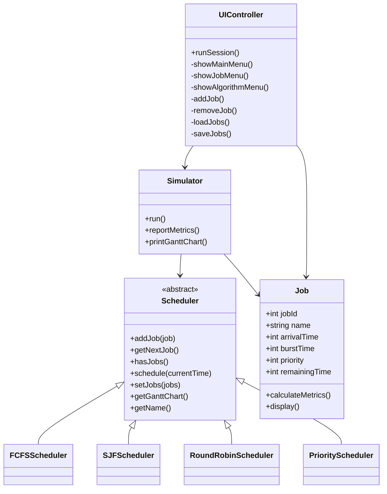
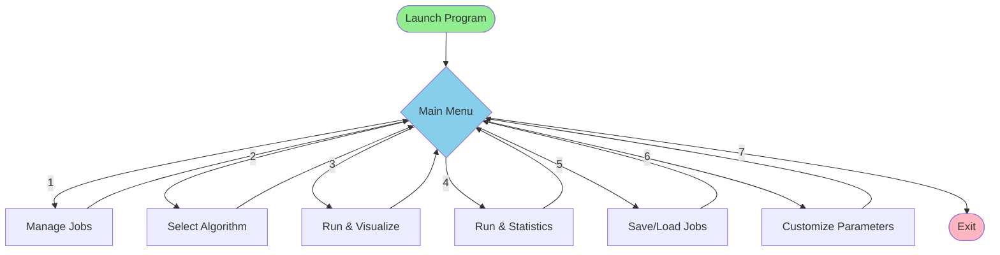

# C++ Job Scheduling Simulator

A comprehensive CPU job scheduling simulator implementing multiple scheduling algorithms with an interactive command-line interface. Perfect for learning operating system concepts and comparing algorithm performance.

## Features

### Scheduling Algorithms
- **FCFS (First-Come-First-Served)** - Non-preemptive queue-based scheduling
- **SJF (Shortest Job First)** - Preemptive scheduling based on remaining burst time
- **Round Robin** - Time-quantum based preemptive scheduling with configurable quantum
- **Priority Scheduling** - Preemptive with aging mechanism to prevent starvation

### Interactive Features
- **Menu-Driven Interface** - Easy navigation through all scheduler operations
- **Dynamic Job Management** - Add, remove, and list jobs during runtime
- **Real-time Visualization** - Gantt chart generation showing job execution timeline
- **Performance Metrics** - Calculate and display:
  - Average Turnaround Time
  - Average Waiting Time
  - Individual job statistics
- **Session Persistence** - Save and load job configurations via CSV files
- **Customizable Parameters**:
  - Round Robin time quantum (default: 2)
  - Priority aging threshold (default: 5)
  - Priority aging increment (default: 1)

### Architecture
- **Extensible Design** - Strategy pattern for easy algorithm additions
- **Two Implementations**:
  - Single-file (`JobScheduler.cpp`) - Self-contained, portable
  - Modular (`src/` + `include/`) - Professional structure with separation of concerns

---

## Quick Start

### Single-File Implementation (Recommended)

**Compile:**
```bash
g++ -std=c++17 JobScheduler.cpp -o JobScheduler
```

**Run:**
```bash
./JobScheduler
```

### Modular Implementation

**Compile:**
```bash
g++ -std=c++17 -I include src/*.cpp -o ModularScheduler
```

**Run:**
```bash
./ModularScheduler
```

---

## Usage Guide

### Main Menu

Upon launching, you'll see:

```
=== Advanced Job Scheduler ===
1. Manage Jobs
2. Select Scheduling Algorithm
3. Run Scheduler & View Visualization
4. Run Scheduler & View Statistics
5. Session Persistence
6. Customization
7. Exit
```

### Menu Options

**1. Manage Jobs**
- Add new jobs with custom arrival time, burst time, and priority
- Remove existing jobs
- List all current jobs with their properties

**2. Select Scheduling Algorithm**
- Choose from FCFS, SJF, Round Robin, or Priority
- Current algorithm is displayed

**3. Run Scheduler & View Visualization**
- Execute the selected algorithm
- Display Gantt chart showing job execution timeline

**4. Run Scheduler & View Statistics**
- Run the scheduler
- Show detailed job metrics and averages

**5. Session Persistence**
- Save current jobs to CSV file
- Load jobs from CSV file

**6. Customization**
- Set Round Robin quantum
- Configure priority aging parameters

---

## CSV File Format

The scheduler supports CSV files with the following format:

```csv
id,arrival,burst,priority
1,0,5,2
2,2,3,1
3,4,1,3
4,6,2,2
```

**Fields:**
- `id` - Unique job identifier (integer)
- `arrival` - Arrival time (integer)
- `burst` - CPU burst time (integer)
- `priority` - Priority value (lower = higher priority)

The included `jobs.csv` provides sample data for testing.

---

## Project Structure

```
Job Scheduling Algorithms/
├── JobScheduler.cpp          # Single-file implementation (recommended)
├── JobScheduler              # Compiled executable
├── jobs.csv                  # Sample job data
├── CLAUDE.md                 # Documentation for Claude Code
├── README.md                 # This file
│
├── src/                      # Modular implementation
│   ├── main.cpp              # Entry point
│   ├── Job.cpp               # Job class implementation
│   ├── Simulator.cpp         # Scheduler execution engine
│   ├── UIController.cpp      # Menu and user interface
│   ├── FCFSScheduler.cpp     # FCFS algorithm
│   ├── SJFScheduler.cpp      # SJF algorithm
│   ├── RoundRobinScheduler.cpp  # Round Robin algorithm
│   └── PriorityScheduler.cpp    # Priority algorithm
│
└── include/                  # Header files
    ├── Job.h                 # Job class definition
    ├── Scheduler.h           # Abstract scheduler interface
    ├── Simulator.h           # Simulator class
    ├── UIController.h        # UI controller
    ├── SchedulerFactory.h    # Plugin system (advanced)
    ├── FCFSScheduler.h
    ├── SJFScheduler.h
    ├── RoundRobinScheduler.h
    └── PriorityScheduler.h
```

---

## Architecture Overview

### Design Pattern: Strategy

The project uses the Strategy design pattern to encapsulate scheduling algorithms:

```
┌─────────────┐
│  Scheduler  │ (Abstract Interface)
└──────┬──────┘
       │
       ├─── FCFSScheduler
       ├─── SJFScheduler
       ├─── RoundRobinScheduler
       └─── PriorityScheduler
```

### Class Diagram



### Application Flow



---

## Algorithm Comparison

| Algorithm | Type | Advantages | Disadvantages |
|-----------|------|------------|---------------|
| **FCFS** | Non-preemptive | Simple, fair order | Convoy effect |
| **SJF** | Preemptive | Minimizes avg waiting time | Starvation possible |
| **Round Robin** | Preemptive | Fair CPU time sharing | Context switch overhead |
| **Priority** | Preemptive | Important jobs first | Starvation (solved via aging) |

---

## Example Output

```
Job Name: Job1 | Job ID: 1 | Arrival: 0 | Burst: 5 | Priority: 2
Start: 0 | Completion: 5 | Waiting: 0 | Turnaround: 5

Job Name: Job2 | Job ID: 2 | Arrival: 2 | Burst: 3 | Priority: 1
Start: 5 | Completion: 8 | Waiting: 3 | Turnaround: 6

Average Turnaround Time: 5.50
Average Waiting Time: 1.50
```

---

## Extending the Scheduler

To add a new scheduling algorithm:

1. **Create Header** (`include/NewScheduler.h`)
```cpp
#pragma once
#include "Scheduler.h"

class NewScheduler : public Scheduler {
public:
    void addJob(const Job& job) override;
    Job getNextJob() override;
    bool hasJobs() const override;
    void schedule(int currentTime) override;
    void setJobs(const std::vector<Job>& jobs) override;
    std::string getGanttChart() const override;
    std::string getName() const override;
};
```

2. **Implement** (`src/NewScheduler.cpp`)

3. **Update UIController** - Add to algorithm selection menu

---

## Requirements

- **Compiler:** C++17 or later
- **OS:** Cross-platform (Windows, Linux, macOS)
- **Dependencies:** Standard library only

---

## License

MIT License - See project files for details

---

## Educational Purpose

This project demonstrates:
- Object-oriented design patterns (Strategy, Factory)
- CPU scheduling algorithms
- Process synchronization concepts
- Performance metric calculations
- Interactive CLI development
- CSV file I/O
- Time complexity analysis

Perfect for:
- Operating systems courses
- Algorithm analysis
- C++ programming practice
- Understanding process scheduling

---

## Author Notes

This simulator was designed as an educational tool for understanding CPU scheduling. Each algorithm implementation closely follows the theoretical definitions while providing practical visualization and metrics.

The dual architecture (single-file vs. modular) serves different purposes:
- **Single-file**: Quick deployment, self-contained learning
- **Modular**: Professional structure, easier maintenance and extension
